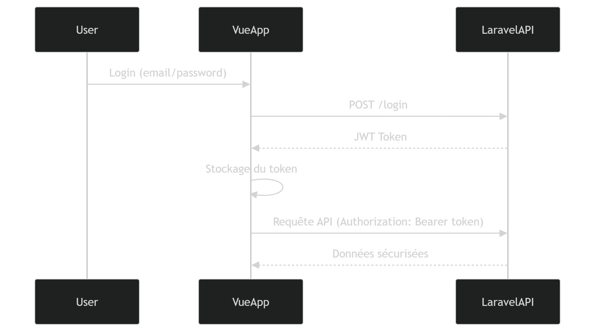

# Système d’authentification API JWT avec Laravel & Vue.js SPA
## Présentation

Ce projet est une implémentation complète d’un système d’authentification moderne basé sur des API REST sécurisées avec JWT, couplé à une Single Page Application (SPA) développée avec Vue.js et intégrée directement dans Laravel.

👉 Il illustre un flux d’authentification end-to-end, du backend jusqu’au frontend.

### 🧾 Description

L’objectif principal de ce projet est de démontrer :

La mise en place d’une authentification stateless avec JWT
La sécurisation des endpoints API
La communication sécurisée entre un backend Laravel et un frontend Vue.js
Une architecture propre et scalable
### 🎯 Objectifs
 - Implémenter une authentification JWT stateless
 - Sécuriser les routes API avec gestion des accès
 - Concevoir une SPA consommant des API sécurisées
 - Mettre en place une architecture claire Backend ↔ Frontend
 - Servir de base pédagogique pour la formation aux API sécurisées
 - Fonctionnalités principales
 - Backend — Laravel API
 - Inscription utilisateur
 - Connexion avec génération de token JWT
 - Rafraîchissement du token
 - Déconnexion sécurisée (invalidation du token)
 - Middleware de protection des routes
 - Gestion des erreurs & accès non autorisés
 - Frontend — Vue.js SPA
 - Formulaires d’inscription & connexion
 - Stockage et gestion du token JWT
 - Intercepteurs HTTP (Axios)
 - Gestion de session utilisateur
 - Routes protégées (Auth Guard)
 - Communication sécurisée avec l’API Laravel
 - Concepts clés
 - Authentification JWT (stateless)
 - API REST sécurisées
 - Gestion de session côté client
 - Architecture SPA
 - Séparation des responsabilités (Backend / Frontend)
 - Bonnes pratiques de sécurité (tokens, headers, middleware)
 - Stack technique

### Technologie	Rôle
- Laravel	Backend API REST
- JWT Auth	Authentification (tymon/jwt-auth ou équivalent)
- Vue.js	Frontend SPA
- Fetch	Communication API
- MySQL	Base de données

🔐 Flux d’authentification

### Cas d’usage
- Formation aux API sécurisées
- Base pour projet SaaS
- Starter kit pour applications modernes

Démonstration d’architecture SPA + API
- 📌 Bonnes pratiques implémentées
- ✔️ Séparation des services (AuthService, TokenService, etc.)
- ✔️ Utilisation de middlewares pour sécuriser les routes
- ✔️ Gestion centralisée des erreurs
- ✔️ Intercepteurs Axios pour automatiser les headers
- ✔️ Gestion propre des tokens (refresh / expiration)